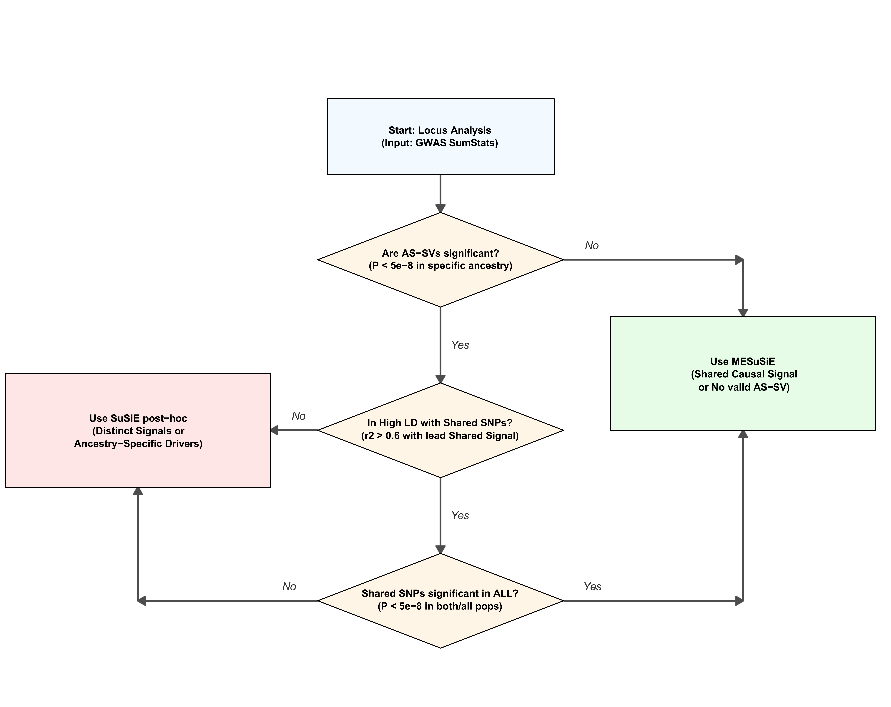

# MFD

**MFD** (Multi-ancestry Fine-mapping Decision) is an R package that adaptively selects between joint and post-hoc multi-ancestry fine-mapping strategies based on locus-level genetic architecture.

> Analysis code for the benchmarking study is available at [gchen4422/MFD_analysis](https://github.com/gchen4422/MFD_analysis/tree/main).

> **Detailed tutorials** (installation, data preparation, worked examples, and visualization) are available at the [MFD website](https://gchen4422.github.io/MFD/).

## How It Works

MFD chooses between two fine-mapping paths using a three-step decision rule:

1. **No significant ancestry-specific segregating variants (AS-SVs)?** → Use **MESuSiE** (joint modeling leverages shared LD structure for higher resolution)
2. **Significant AS-SVs with low LD to shared signals (r² < 0.6)?** → Use **SuSiE post-hoc** (runs SuSiE-RSS independently per ancestry, then merges with a consensus LD matrix)
3. **Significant AS-SVs in high LD with shared signals?** → Use **MESuSiE** if shared signal is genome-wide significant in all ancestries; otherwise **SuSiE post-hoc**



## Installation

```r
# MESuSiE is not on CRAN and must be installed manually first
devtools::install_github("borangao/MESuSiE")

# All other dependencies (susieR, data.table, dplyr, tidyr) are on CRAN
# and will be installed automatically
devtools::install_github("gchen4422/MFD")
```

## Quick Start

```r
library(MFD)

# Load the built-in example data (EUR and AFR summary stats + LD matrices for a chr6 locus)
data(summary_stat_1)  # EUR GWAS summary statistics
data(summary_stat_2)  # AFR GWAS summary statistics
data(susie_EU_cov)    # EUR LD correlation matrix
data(susie_BB_cov)    # AFR LD correlation matrix

result <- run_mf_decision_2pop(
  summary_stat_1, summary_stat_2,
  susie_EU_cov,   susie_BB_cov,
  pop_names = c("EUR", "AFR")
)

result$decision     # which method was used and why
result$results      # per-SNP PIPs and credible sets
result$raw_objects  # raw SuSiE or MESuSiE model objects
```

### Using MFD with three or more ancestries

MFD supports two or more ancestry groups. For K-ancestry analysis, provide
GWAS summary statistics and their matching LD matrices as named lists. The
names and ordering of `gwas_list` and `ld_list` must agree.

```r
gwas_list <- list(
  EUR = summary_stat_eur,
  AFR = summary_stat_afr,
  EAS = summary_stat_eas
)

ld_list <- list(
  EUR = ld_eur,
  AFR = ld_afr,
  EAS = ld_eas
)

result <- run_mf_decision(
  gwas_list = gwas_list,
  ld_list = ld_list
)

result$decision
head(result$results)
```

For K ancestries, the output contains ancestry-specific columns named
`PIP_Ancestry_1` through `PIP_Ancestry_K` and `CS_Ancestry_1` through
`CS_Ancestry_K`. Their ordering follows the names in `gwas_list`.

### Input format (`gwas_list[[1]]` / `gwas_list[[2]]` / ... / `gwas_list[[K]]`)

Each ancestry-specific GWAS table uses the same column format. The pairwise
K=2 analysis is a special case of this general K-ancestry input.

| Column | Required | Description |
|--------|----------|-------------|
| `SNP`  | Yes | Variant ID (rsID or chr:pos); must match LD matrix names |
| `CHR`  | Yes | Chromosome |
| `POS`  | Yes | Base-pair position |
| `Z`    | Yes | Z-score (Beta / Se) |
| `Beta` | Optional | Effect size |
| `Se`   | Optional | Standard error |
| `N`    | Optional | Sample size |

### Output (`result$results`)

| Column | Description |
|--------|-------------|
| `PIP_Either` | Probability of being causal in **at least one** ancestry (primary discovery metric) |
| `PIP_Shared` | Probability of being causal in **all K** ancestries |
| `PIP_Ancestry_1/2/.../K` | Ancestry-specific causal probability for ancestries 1 through K |
| `CS` | "Either" 95% credible set membership (0 = not in any CS) |
| `CS_Ancestry_1/2/.../K` | Ancestry-specific credible set membership for ancestries 1 through K |

A common threshold to declare a fine-mapped signal is `PIP_Either > 0.5`.

## Key Parameters

| Parameter | Default | Description |
|-----------|---------|-------------|
| `L` | `10` | Maximum number of causal effects per region |
| `p_thresh` | `5e-8` | P-value threshold to define significant AS-SVs and shared variants |
| `r2_thresh` | `0.6` | LD threshold for the decision rule and post-hoc CS merging |
| `prior_weights` | `NULL` | Per-SNP prior probability (e.g., from functional annotations) |
| `ancestry_weight` | `NULL` | Ancestry weights passed to MESuSiE |
| `pop_names` | `names(gwas_list)` | Labels for the input ancestries |

## Dependencies

`MESuSiE`, `susieR`, `data.table`, `dplyr`, `tidyr`
